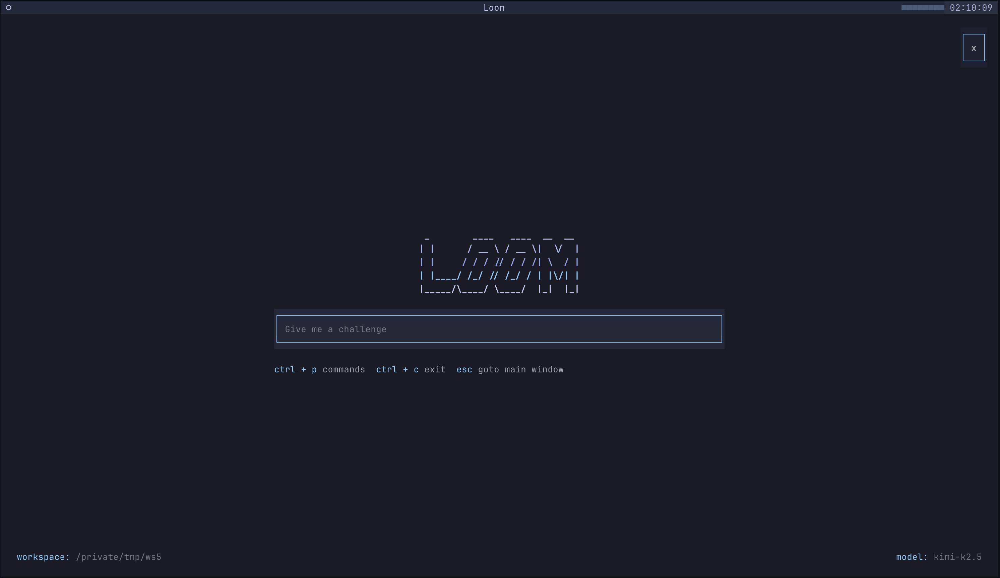
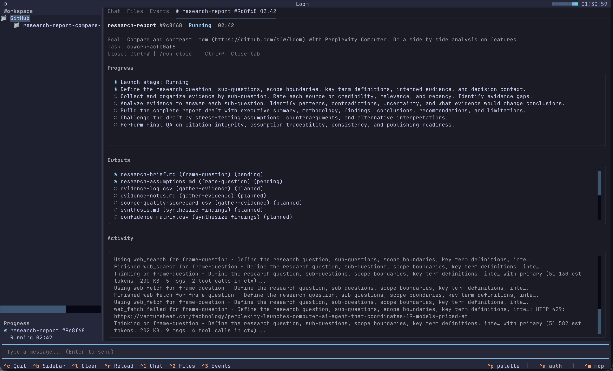

# Loom
[](https://github.com/sfw/loom/actions/workflows/ci.yml)
[](https://github.com/sfw/loom/actions/workflows/process-canary.yml)



**Local-ready LLM execution harness** for complex tasks.

Loom decomposes goals, drives execution through verified steps, routes between thinking and acting models, and keeps work on track with structured state instead of chat history. Use it via TUI, CLI, API, or MCP with local or mixed local/cloud models.

Bring Kimi, Minimax, GLM, Claude, or any OpenAI-compatible model and Loom supplies the harness: tool calling, structured planning, parallel execution, independent verification, and persistent memory.

It handles coding, research, document analysis (PDF, Word docs, PowerPoint decks), report generation, and multi-step business workflows.

> Release: **v0.2.0** is now available. See [CHANGELOG](CHANGELOG.md) for details.



**Claude-class cowork UX, local-ready.** Tools like Claude Code and Claude cowork deliver strong agentic experiences, and Claude Code can be paired with local model stacks depending on your setup. Loom's focus is different: a model-agnostic harness designed to keep local and mixed local/cloud execution reliable with structured planning, tool safety, independent verification, and persistent memory. Loom is also cross-platform, while Claude cowork is currently macOS + Claude-model oriented. The result is an agentic workflow that stays robust on your own hardware without locking you to one provider.

Loom also exposes a REST API and an MCP server built for agentic systems. Orchestrators like OpenClaw can call Loom's REST endpoints -- or connect via the Model Context Protocol -- to offload complex multi-step tasks: decomposition, tool calling, verification, and memory. Instead of hoping a single LLM call handles a 15-step workflow, hand it to Loom and let the harness drive. The MCP integration also means any MCP-compatible agent or IDE can use Loom as a tool provider out of the box.


## Why Loom Exists

LLMs are insanely powerful in small bursts, but they lack the framework to handle larger problems. They’re the fruit flies of the tech world: a 20-second memory with a 180 IQ. You get moments of brilliance, followed immediately by senility.

Context windows fill fast. They crush details to make room until they forget what they’re even working on. Eventually, they get so lost they’ll happily declare "DONE!" after finishing step one of a 100-step problem, simply because the other 99 steps were compacted away two cycles ago.

Loom weaves those flashes of brilliance together. It’s an engineering fix for the LLM’s biggest pain point, using a dedicated system of execution, verification, and replanning to actually see a task through to the end.

Loom breaks complex work into smaller, solvable units, runs them in sequence, and verifies each result before moving forward. That lets you use model intelligence where it is strongest while reducing hallucinations, compounding errors, and dead-end reasoning.

Loom is local-ready and supports local models natively, so you get privacy, control, and lower operating cost. It is not limited to local inference: you can use cloud models too, and apply Loom to far more than coding, including research, analysis, and operational workflows.

## Two Ways to Work

**Interactive** (`uv run loom`) -- Work with a model in a rich terminal UI. You talk, the model responds and uses tools, you see what it's doing in real time. Streaming text, inline diffs, per-tool-call approval, session persistence, conversation recall, and slash commands for control.

**Autonomous** (`uv run loom run`) -- Give Loom a goal, walk away. It decomposes the work into subtasks with a dependency graph, runs independent subtasks in parallel, verifies each result with an independent model, and replans when things go wrong.

```
                    +----------------------------+
Goal -> Planner ->  | [Subtask A]  [Subtask B]   |  parallel batch
                    |     |             |         |  (if independent)
                    |  Execute       Execute      |
                    |  Verify        Verify       |
                    |  Extract*      Extract*     |  * fire-and-forget
                    +----------------------------+
                               |
                         [Subtask C]  (depends on A+B)
                              |
                          Completed
```

## What Makes It Different

**Built for local model weaknesses.** Cloud models reproduce strings precisely. Local models don't -- they drift on whitespace, swap tabs for spaces, drop trailing newlines. Loom's edit tool handles this with fuzzy matching: when an exact string match fails, it normalizes whitespace and finds the closest candidate above a similarity threshold. It also rejects ambiguous matches (two similar regions) so it won't silently edit the wrong place. This is the difference between a tool that works with MiniMax and one that fails 30% of the time.

**Lossless memory, not lossy summarization.** Most agents compress old conversation turns into summaries when context fills up. This destroys information. Loom takes a different approach: every cowork turn is persisted verbatim to SQLite. When context fills up, old turns drop out of the model's window but remain fully searchable. The model has a `conversation_recall` tool to retrieve anything it needs -- specific turns, tool call history, full-text search. Resume any previous session exactly where you left off with `--resume`. This archival guarantee is for cowork history; `/run` and `uv run loom run` may semantically compact model-facing payloads to stay within context budgets, while preserving source artifacts/logs.

**The harness drives, not the model.** The model is a reasoning engine called repeatedly with scoped prompts. The orchestrator decides what happens next: which subtasks to run, when to verify, when to replan, when to escalate. This means a weaker model in a strong harness outperforms a stronger model in a weak one.

**Verification as a separate concern.** The model never checks its own work. An independent verifier (which can be a different, cheaper model) validates results at three tiers: deterministic checks (does the output exist? does it meet structural requirements?), independent LLM review, and multi-vote consensus for high-stakes changes.

**Full undo.** Every file write is preceded by a snapshot. You can revert any individual change, all changes from a subtask, or the entire task. The changelog tracks creates, modifies, deletes, and renames with before-state snapshots.

**Dozens of built-in tools.** Loom includes file operations (read/write/edit/delete/move with fuzzy matching), shell + git safety, ripgrep + glob search, web fetch/search, code analysis (tree-sitter when installed; regex fallback), calculator + spreadsheet operations, document generation, task tracking, and conversation recall. Optional software-development integrations add external coding-agent tools (`openai_codex`, `claude_code`, `opencode`) and WordPress workflow tools (`wp_cli`, `wp_env`, block scaffolding, quality gates) behind execution feature flags.

It also ships research helpers (academic search, archives, citations, fact checking, OCR, timeline/inflation analysis, correspondence/social mapping) plus a keyless investment suite for market data, SEC fundamentals, macro regime scoring, factor exposure, valuation, ranking, and portfolio analysis/recommendation. Tools are auto-discovered via `__init_subclass__`.

**Inline diffs.** Every file edit produces a unified diff in the tool result. Diffs render with Rich markup syntax highlighting in the TUI -- green additions, red removals. You always see exactly what changed.

**Process definitions.** YAML-based domain specialization lets you define personas, phase blueprints, verification/remediation policy, evidence contracts, and prompt constraints for any workflow (`schema_version: 2`). A process can represent a consulting methodology, an investment analysis framework, a research protocol, or a coding standard -- the engine doesn't care. Loom ships with 6 built-in processes and supports installing more from GitHub.

## Quick Start

If you're new, start with:

1. `uv sync` to install dependencies.
2. `uv run loom -w /path/to/workspace` to launch the TUI and run setup.
3. `/run <goal>` inside the TUI for your first harnessed task.
4. `uv run loom run "<goal>" -w /path/to/workspace` for autonomous execution.

```bash
# Install
uv sync          # or: pip install -e .

# Launch — the setup wizard runs automatically on first start
uv run loom -w /path/to/workspace

# With a process definition (explicit run command)
uv run loom -w /path/to/workspace
# /consulting-engagement Analyze client onboarding flow

# Force process orchestration from inside the TUI (no uv run loom serve required)
# /processes                     # process catalog
# /run Analyze Tesla for investment
# /run problem.md            # load goal from workspace file
# /run @problem.md prioritize parser issues
# /run close                 # close current run tab (with confirmation)
# /investment-analysis Analyze Tesla for investment

# Resume a previous session
uv run loom --resume <session-id>

# Autonomous task execution
uv run loom run "Refactor the auth module to use JWT" --workspace /path/to/project
uv run loom run "Research competitive landscape for X and produce a briefing" -w /tmp/research
uv run loom run "Analyze Q3 financials and flag anomalies" -w /tmp/analysis

# Start the API server (for programmatic access)
uv run loom serve
```

## Configuration

On first launch, Loom's built-in setup wizard walks you through provider selection, model configuration, and role assignment — all inside the TUI. The wizard writes `~/.loom/loom.toml` for you. Run `/setup` from inside the TUI at any time to reconfigure, or `uv run loom setup` from the CLI.

You can also create the config manually. Loom reads `loom.toml` from the current directory or `~/.loom/loom.toml`:

```toml
[models.primary]
provider = "ollama"                    # or "openai_compatible" or "anthropic"
base_url = "http://localhost:11434"
model = "kimi-k2.5"
max_tokens = 8192
temperature = 0.1
roles = ["planner", "verifier"]

[models.utility]
provider = "ollama"
base_url = "http://localhost:11434"
model = "minimax-m2.1"
max_tokens = 2048
temperature = 0.0
roles = ["extractor", "executor", "compactor"]

[execution]
max_subtask_retries = 3
max_loop_iterations = 50
max_parallel_subtasks = 3
delegate_task_timeout_seconds = 3600
enable_process_iteration_loops = false
enable_iteration_command_exit_gate = false

[telemetry]
mode = "active" # off | active | all_typed | debug
runtime_override_enabled = true
runtime_override_api_enabled = false
runtime_override_api_token = ""
persist_runtime_override = false
debug_diagnostics_rate_per_minute = 120
debug_diagnostics_burst = 30

[limits.runner]
enable_filetype_ingest_router = true
enable_artifact_telemetry_events = true
artifact_telemetry_max_metadata_chars = 1200
enable_model_overflow_fallback = true
ingest_artifact_retention_max_age_days = 14
ingest_artifact_retention_max_files_per_scope = 96
ingest_artifact_retention_max_bytes_per_scope = 268435456
```

For TUI startup behavior:

```toml
[tui]
startup_landing_enabled = true    # show landing when startup is not resuming
always_open_chat_directly = false # bypass landing and enter chat immediately
```

`always_open_chat_directly` takes precedence when set to `true`.

Three model backends: Ollama, OpenAI-compatible APIs (LM Studio, vLLM, text-generation-webui), and Anthropic/Claude. Models are assigned roles (`planner`, `executor`, `extractor`, `verifier`, `compactor`). A common split is stronger model for planning + verification and cheaper model for extraction + execution + compaction.
Manage external MCP servers in `~/.loom/mcp.toml` (or workspace `./.loom/mcp.toml`):

```toml
[mcp.servers.notion]
command = "npx"
args = ["-y", "@modelcontextprotocol/server-notion"]
timeout_seconds = 30
enabled = true

[mcp.servers.notion.env]
NOTION_TOKEN = "${NOTION_TOKEN}"
```

MCP merge precedence is: `--mcp-config` > `./.loom/mcp.toml` > `~/.loom/mcp.toml` > legacy `[mcp]` in `loom.toml`.
Configured MCP servers are auto-discovered at startup and registered as namespaced tools (`mcp.<server>.<tool>`).
When a run has an auth context, MCP discovery is scoped to that run's selected
profiles; auth-scoped MCP tools are not leaked into the global registry view
used by other concurrent runs.
For OAuth-enabled remote aliases, use browser-first login:

```bash
uv run loom mcp auth login <alias>
```

Use `--manual-token --access-token ...` only as a headless fallback.
MCP OAuth alias tokens are stored separately in `~/.loom/mcp_oauth_tokens.json`.
This store is intentionally separate from `/auth` profile token refs in
`~/.loom/auth.toml`.
`delegate_task` (used by `/run`) defaults to a 3600s timeout. Configure this in
`loom.toml` under `[execution].delegate_task_timeout_seconds`; env override
`LOOM_DELEGATE_TIMEOUT_SECONDS` still applies when set.

For artifact and overflow transparency telemetry in `.events.jsonl`, enable
`[limits.runner].enable_artifact_telemetry_events` (default `true`; set to `false` to disable).
Use `artifact_telemetry_max_metadata_chars` to bound handler metadata payload size.
For operator-facing runtime telemetry verbosity, use `[telemetry].mode` (`off`, `active`,
`all_typed`, `debug`). You can inspect/change process-local runtime mode through
`GET/PATCH /settings/telemetry` (loopback + admin token required when mutation is enabled,
via `x-loom-admin-token` or `Authorization: Bearer ...`), or via TUI slash command
`/telemetry`.
For large fetched binaries/documents (PDFs, Office files, archives), tune
`[limits.runner]` retention keys to control cleanup pressure:
`ingest_artifact_retention_max_age_days`,
`ingest_artifact_retention_max_files_per_scope`, and
`ingest_artifact_retention_max_bytes_per_scope`.

### Latency Diagnostics and Smoke Benchmarks

Enable runtime latency diagnostics:

```bash
LOOM_LATENCY_DIAGNOSTICS=1 uv run loom
```

This emits low-overhead timing lines for key paths (event-loop lag probes,
MCP discovery/refresh, process index refresh, setup discovery, and API task
preflight timing).

Run local startup/discovery latency smoke checks:

```bash
uv run python scripts/latency_smoke.py
uv run python scripts/latency_smoke.py --iterations 5 --workspace /path/to/workspace
```

The script reports mean/p50/p95 timings for process catalog scan and tool
registry creation with sync vs background MCP startup modes.

### Database Upgrades

Loom now uses explicit schema migrations tracked in `schema_migrations`.
On startup, existing DBs are upgraded before runtime features are allowed to
continue. If an existing DB cannot be upgraded, startup fails with a clear
actionable error instead of silently falling back to ephemeral mode.
For new DB initialization failures (path/permissions), startup is also a hard
error by default; use `--ephemeral` to opt into non-persistent mode.

Use:

```bash
uv run loom db status
uv run loom db migrate
uv run loom db doctor
uv run loom db backup
```

```bash
# explicit non-persistent mode when DB init fails
uv run loom --ephemeral
```

See migration authoring and policy details in
[`docs/DB-MIGRATIONS.md`](docs/DB-MIGRATIONS.md).

## Auth Profiles and Run-Time Resolution

Loom stores credential metadata (not plaintext secrets) in `~/.loom/auth.toml`.
Workspace defaults can be set in `./.loom/auth.defaults.toml`.
Resource registry + bindings are stored in `./.loom/auth.resources.toml`.

Auth resolution happens at run start using this order:
1. Explicit run overrides by `resource_id` / `resource_ref` / provider selector
2. Workspace resource defaults (`resource_id -> profile_id`)
3. User resource defaults (`resource_id -> profile_id`)
4. Legacy provider defaults (workspace, then user)
5. Auto-select when exactly one profile matches a required resource

Required auth resources are collected from:
- Process `auth.required`
- Declared tool `auth_requirements` on all allowed tools for the process
  (tools excluded by `process.tools.excluded` are not considered)

UX behavior:
- TUI `/auth` auto-discovers missing resource contracts and seeds draft profiles.
- TUI `/run` does not require a pre-step `/auth select ...`.
- If multiple profiles match, Loom prompts for a choice at run start.
- If auth is missing/invalid/expired/unbound, run start offers opening Auth Manager and
  retries preflight after changes.
- If exactly one profile exists for a resource, it is auto-defaulted for that workspace.

CLI:
- `uv run loom auth sync` runs the same draft/resource sync flow headlessly.
- `uv run loom auth select <selector> <profile_id>` persists a workspace default
  (provider selector or resource selector such as `api_integration:notion`).
- `uv run loom auth audit` reports orphaned/dangling auth state and exits non-zero on findings.
- `uv run loom auth migrate` infers resource bindings/defaults from legacy provider state.
- `uv run loom auth migrate` takes a preflight snapshot and auto-rolls back if migration fails.
- `uv run loom auth migrate --rollback <snapshot-dir>` restores auth files from a migration snapshot.

API behavior:
- Non-interactive unresolved auth returns HTTP 400 with structured
  `code=auth_unresolved` payload so clients can choose a profile and retry.

## Process Definitions

A process definition injects a persona, phase blueprint, verification/remediation policy, evidence schema, and prompt constraints without changing engine code. Loom ships with 6 built-in processes: investment analysis, marketing strategy, research report, competitive intelligence, consulting engagement, and market research. You can [create your own](docs/creating-packages.md) or install them from GitHub:

```bash
uv run loom processes                              # list available
uv run loom -w /tmp/acme
# /consulting-engagement Draft a Q2 market strategy
uv run loom install user/repo                      # install from GitHub
uv run loom install user/repo --isolated-deps      # per-process dependency env
uv run loom process test consulting-engagement     # run process test cases
```

Process-required tools are enforced at runtime: if `tools.required` contains
missing tools, process activation/task creation fails fast with a clear error.

Process contract v2 is the recommended authoring format (`schema_version: 2`),
with behavior declared under `verification.policy`, `verification.remediation`,
`evidence`, `validity_contract`, and `prompt_contracts`. v1 definitions still load in compatibility
mode, with compatibility removal targeted for June 30, 2026.

Current schema additions for process safety/evidence rigor:
- `risk_level` (`low|medium|high|critical`) to make default rigor floors explicit.
- `validity_contract` for claim extraction, prune behavior, and synthesis gates.
- `final_gate.temporal_consistency` for as-of alignment, stale-source checks, and date-conflict detection.

```yaml
schema_version: 2
risk_level: high
validity_contract:
  enabled: true
  claim_extraction: { enabled: true }
  min_supported_ratio: 0.8
  max_unverified_ratio: 0.2
  max_contradicted_count: 0
  prune_mode: rewrite_uncertainty
  final_gate:
    enforce_verified_context_only: true
    synthesis_min_verification_tier: 2
    critical_claim_support_ratio: 1.0
    temporal_consistency:
      enabled: true
      require_as_of_alignment: true
      enforce_cross_claim_date_conflict_check: true
      max_source_age_days: 365
```

Both ad hoc and defined process runs use the same enforcement path for these
contracts (claim pruning/intermediate continuation, synthesis gating, and final
failure on unsupported critical claims). For full authoring + migration guidance,
see [docs/creating-packages.md](docs/creating-packages.md).
Run telemetry now includes `run_validity_scorecard` and
`artifact_seal_validation` for evidence/provenance audits.

## Adaptive Learning

Loom learns from your interactions so you never repeat yourself. Two learning modes work together:

**Operational learning** (autonomous tasks) -- after every task, Loom extracts model success rates, retry patterns, and successful plan templates. These inform future model selection and planning.

**Behavioral learning** (all interactions) -- Loom detects the gap between what the model delivered and what you actually wanted. When you say "test and lint it" after the model considers its code done, that's a gap signal. Loom extracts a general behavioral rule ("run tests and linter after writing code") and injects it into future prompts. Explicit corrections ("no, use JSON not YAML") are captured the same way.

Patterns are frequency-weighted -- the more a pattern is observed, the higher it ranks. High-frequency patterns persist indefinitely; low-frequency ones are pruned after 90 days. All data stays local in your SQLite database.

```bash
uv run loom learned                              # review learned behavioral patterns
uv run loom learned --all                        # include internal operational patterns
uv run loom learned --type behavioral_gap        # filter by type
uv run loom learned --delete 5                   # remove a specific pattern
uv run loom reset-learning                       # clear everything
```

In the TUI, use `/learned` to open an interactive review screen for learned behavioral patterns, where you can inspect and delete individual items.

## Interfaces

- **Interactive TUI** (`uv run loom`) -- rich terminal interface with chat panel, sidebar, diff viewer, tool approval modals, event log, and setup wizard. Includes session persistence/recall, task delegation, process discovery (`/processes`), in-process orchestration (`/run <goal|@goal-file [goal]|close [run-id-prefix]>`), direct process commands (`/<process-name> <goal>`), learned-pattern review (`/learned`), MCP config controls (`/mcp ...`), auth profile controls (`/auth ...`), and click-to-open workspace previews for Markdown/code/JSON/CSV/HTML/diff/Office/PDF/images. `Ctrl+W` closes the active process-run tab with confirmation. `/run` executes in-process and does not require `uv run loom serve`; `/run problem.md` and `/run @problem.md optional-goal` load file content into planning context.
- **REST API** -- 20 endpoints for task CRUD, SSE streaming, steering, approval, feedback, memory search
- **MCP server** -- Model Context Protocol integration so other agents can use Loom as a tool

## CLI Commands

```
uv run loom                    Launch the interactive TUI (default; setup wizard on first run)
uv run loom cowork             Alias for the interactive TUI
uv run loom setup              Run the configuration wizard (CLI fallback)
uv run loom run GOAL           Autonomous task execution (server-backed) with `/run`-equivalent process resolution
uv run loom serve              Start the API server
uv run loom status ID          Check task status
uv run loom cancel ID          Cancel a running task
uv run loom models             List configured models
uv run loom auth ...           Manage auth profiles/default selectors
uv run loom processes          List available process definitions
uv run loom install SOURCE     Install a process package
uv run loom uninstall NAME     Remove a process package
uv run loom process test NAME  Run process package test cases
uv run loom mcp ...            Manage MCP server config (list/show/add/edit/remove/test/migrate)
uv run loom mcp-serve          Start the MCP server (stdio transport)
uv run loom learned            Review learned patterns (behavioral by default)
uv run loom reset-learning     Clear all learned patterns
```

Common flags for `uv run loom` / `uv run loom cowork`:
- `-w /path` -- workspace directory
- `--mcp-config /path/to/mcp.toml` -- explicit MCP config layer
- `-m model` -- explicit cowork model override from config (can bypass role routing)
- `--resume <id>` -- resume a previous session

Role routing note:
- Orchestrator and verifier paths route by role (`planner`, `executor`, `extractor`, `verifier`, `compactor`).
- TUI helper calls (ad hoc process synthesis, run-folder naming) use role-selected helper models when configured.
- Run-folder naming is guardrailed: Loom accepts only clean kebab-case slugs and falls back to deterministic naming when model output is low quality.

## Architecture

Large Python codebase in `src/` with an extensive automated test suite. No frameworks (no LangChain, no CrewAI).

```
src/loom/
  __main__.py            CLI (Click), TUI launcher (default command)
  config.py              TOML config loader
  mcp/                   MCP config manager + merge/migration logic
  api/                   FastAPI server, REST routes, SSE streaming
  cowork/                Conversation session, approval, session state
  engine/                Orchestrator, subtask runner, scheduler, verification
  events/                Pub/sub event bus, persistence, webhooks
  integrations/          MCP server
  learning/              Pattern extraction from execution history
  models/                Provider ABC + Ollama, OpenAI, Anthropic backends
  processes/             Process definition loader + 6 built-in YAML processes
  prompts/               7-section prompt assembler with budget trimming
  recovery/              Approval gates, confidence scoring, retry escalation
  state/                 Task state, SQLite memory archive, conversation store
  tools/                 30 built-in tools with auto-discovery, safety, changelog + tree-sitter backend
  tui/                   Textual TUI: chat, sidebar, diff viewer, modals, events
```

## Development

```bash
uv sync --extra dev     # or: pip install -e ".[dev]"
pytest                  # full test suite
ruff check src/ tests/  # lint
```

## Requirements

- Python 3.11+
- A model backend: [Ollama](https://ollama.com), [LM Studio](https://lmstudio.ai), any OpenAI-compatible API, or [Anthropic/Claude](https://console.anthropic.com)

## License

MIT
