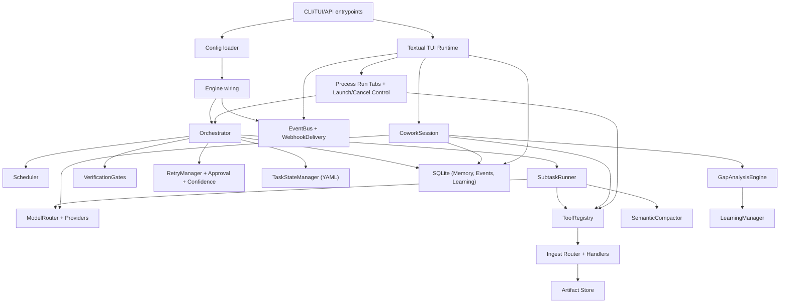
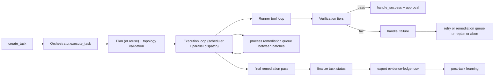

# Loom System Technical Design

## 1. Purpose and Scope

This document is a code-level technical deep dive for the Loom system in `/Users/sfw/Development/loom`.

It explains:
- All major subsystems and their responsibilities.
- Runtime control flow in task orchestration mode, cowork interactive mode, and TUI process-run control flows.
- Core data structures, state and persistence model.
- Decision points, including what inputs drive them and what outcomes they cause.
- Retry, remediation, fallback, and tuning logic.
- Configuration surfaces and how they influence behavior.

This is based on the current implementation in `src/loom/*`.

Implementation refresh status (2026-02-28):
- Reliability hardening workstreams `#1,#2,#3,#4,#5,#6,#10` remain implemented behind execution flags.
- Additional Feb 27-28 coverage includes cowork hybrid-tool exposure, chat replay journaling, delegated-progress streaming, `/run` launch liveness staging, and cancel-first process-tab close semantics.
- Validation snapshot (2026-02-28): `uv run ruff check` passed; `uv run pytest` passed (`2000 passed, 50 skipped, 2 warnings`).
- Default posture remains conservative: hardening controls are mostly opt-in via config.

## 2. High-Level Architecture

Loom has two primary execution modes plus a TUI control plane:
- Task mode: plan -> execute subtasks -> verify -> remediate/replan -> finalize.
- Cowork mode: interactive turn-by-turn assistant with tool loops and persistent conversation state.
- TUI process-run control plane: `/run` preflight staging, concurrent run tabs, delegated progress streaming, and cancel-first close workflow.

### 2.1 Component map

### 2.2 Source domains

- Core orchestration: `src/loom/engine/*`
- Models and retry: `src/loom/models/*`
- Recovery policies: `src/loom/recovery/*`
- Tooling and ingest: `src/loom/tools/*`, `src/loom/ingest/*`
- Process definitions: `src/loom/processes/*`
- Prompts: `src/loom/prompts/*`
- State and persistence: `src/loom/state/*`
- API/server: `src/loom/api/*`
- Events: `src/loom/events/*`
- Cowork interactive mode: `src/loom/cowork/*`
- TUI runtime and screens/widgets: `src/loom/tui/*`
- Auth/runtime resolution: `src/loom/auth/*`
- MCP integration bridge: `src/loom/integrations/*`
- Learning and reflection: `src/loom/learning/*`

## 3. End-to-End Runtime Flows

## 3.1 Task Mode Flow

### 3.1.1 Planning phase

Primary implementation: `engine/orchestrator.py`.

Behavior:
- If `reuse_existing_plan=True` and task already has subtasks, reuse existing plan.
- Else run planner model and parse JSON plan.
- Apply process phase-mode constraints (`strict`, `guided`, `suggestive`).
- Normalize non-terminal synthesis subtasks (except strict mode).
- Validate plan topology before execution.

Validation and normalization checks include:
- Duplicate subtask IDs.
- Unresolved dependencies.
- Dependency cycles.
- Synthesis topology invariants:
  - Synthesis subtasks cannot have dependents.
  - Non-synthesis subtasks cannot depend on synthesis subtasks.

If planner output is invalid topology:
- Planner retries with structural feedback (attempts depend on phase mode).

If planner output parse/model invocation fails after retries:
- Degraded behavior is controlled by `execution.planner_degraded_mode`.
- `allow`: fallback single-subtask plan (`execute-goal`) + `task_plan_degraded` event.
- `require_approval`: task pauses for approval before degraded plan activation.
- `deny`: planning fails fast.

### 3.1.2 Execution loop

The orchestrator executes while:
- There are pending/running subtasks, and
- Loop iterations are below `execution.max_loop_iterations`.
- Global run budget has not been exhausted (when `execution.enable_global_run_budget=true`).

Each loop iteration:
1. Ask scheduler for runnable subtasks.
2. If none runnable:
   - Emit stalled event.
   - Diagnose blocked subtasks.
   - Attempt bounded stall recovery:
     - Normalize non-terminal synthesis when allowed.
     - Or replan using blocked-subtask feedback.
3. Select up to `execution.max_parallel_subtasks` runnable subtasks.
4. Dispatch each subtask via runner (single or `asyncio.gather` parallel path).
5. Process outcomes:
   - Success -> `_handle_success`.
   - Failure -> `_handle_failure` (retry/replan/remediation decisions).
6. Process remediation queue opportunistically between batches.
7. Re-check aggregate budget counters (tokens, model calls, tool calls, mutating tool calls, replans, remediation attempts).

On global budget breach:
- Emit `task_budget_exhausted`.
- Mark pending subtasks as skipped due to budget policy.
- Finalize task as failed with budget snapshot metadata.

### 3.1.3 Subtask runner loop

Primary implementation: `engine/runner.py` (`SubtaskRunner.run`).

Per subtask:
- Set a wall-clock deadline (`max_subtask_wall_clock_seconds`).
- Build executor prompt with memory and evidence summary.
- Select executor model by tier/role.
- Enter tool loop up to iteration budget (`max_tool_iterations` by default).

Per iteration:
- Compact message history according to compaction policy.
- Call model with retry policy.
- If model emits tool calls:
  - Validate tool-call schema.
  - Enforce deliverable write policy when in retry/remediation context.
  - For mutating tools, optionally apply idempotency-ledger dedupe (`execution.enable_mutation_idempotency`).
  - Execute tools.
  - Serialize compact tool results back into context.
  - Append anti-amnesia TODO reminder.
- Else (text-only response): subtask loop ends successfully.

Completion semantics:
- `execution.executor_completion_contract_mode=off`: legacy text-only completion.
- `warn`: allow completion without contract but emit warning.
- `enforce`: require valid completion block; otherwise runner prompts correction and continues loop.

Interruption paths produce failure result:
- Deadline exceeded.
- Model invocation failure after retries.
- Execution ended without usable response.
- Tool-iteration budget exhausted while model still requested tools.

### 3.1.4 Verification flow

Primary implementation: `engine/verification.py`.

Verification tiers:
- Tier 1 deterministic checks.
- Tier 2 LLM verifier.
- Tier 3 voting verifier (optional).

Pipeline behavior:
- Tier 1 failure is terminal for this attempt.
- Tier 2 runs only if Tier 1 passes and enabled.
- Tier 3 runs only if Tier 2 passes and enabled.
- Aggregation can produce `pass_with_warnings` or `partial_verified`.
- Special fallback: if Tier 2 is parse-inconclusive and Tier 1 passed, fallback can accept Tier 1 with warning.

### 3.1.5 Failure handling, retries, remediation, replan

`_handle_failure` decides strategy based on structured verification output and error text:
- `generic`
- `rate_limit`
- `verifier_parse`
- `evidence_gap`
- `unconfirmed_data`

Main outcomes:
- Verifier parse failures can trigger verification-only retry (no executor rerun).
- Failure-resolution planner can generate compact actionable remediation snippets from bounded verification metadata.
- If retries remain: increment retry count and return subtask to pending.
- If retries exhausted:
  - Critical path failures can abort, or run confirm-or-prune remediation, or queue follow-up depending on process policy.
  - Non-critical failures request replanning at batch boundary.

Remediation queue:
- Stores remediation work items in task metadata.
- Supports dedupe/merge for matching unresolved items.
- Per-item attempt counts, bounded exponential backoff, TTL expiry.
- Finalization step forces unresolved blocking remediations to terminal failed state.
- Optional SQLite dual-write/read hydration (`execution.enable_sqlite_remediation_queue`) via `remediation_items` and `remediation_attempts`.

### 3.1.6 Finalization

Final task outcome is computed from:
- Completed vs total subtasks.
- Blocking remediation unresolved state.
- Scheduler blocked-subtask diagnostics.

Terminal status logic:
- `completed`: all subtasks complete and no blocking remediation failures.
- `failed`: otherwise (unless explicitly cancelled).
- `cancelled`: pending subtasks marked skipped.

Post-finalization:
- Evidence ledger CSV exported to workspace as `evidence-ledger.csv` when records exist.
- Telemetry run summary event emitted.
- Post-task learning executed best-effort.

## 3.2 Cowork Mode Flow

Primary implementation: `cowork/session.py`.

Flow:
1. User message appended and persisted.
2. Optional recall hint injected if user message suggests dangling context reference.
3. Turn-scoped tool schema set is selected by `execution.cowork_tool_exposure_mode`:
   - `full`: expose all tool schemas.
   - `adaptive`: expose intent-ranked typed schemas.
   - `hybrid`: expose typed schemas + fallback lane (`list_tools`, `run_tool`).
4. Context window is built with token budget + archive recall index (when older turns are omitted), then sanitized to repair dangling tool-call chains before provider invocation.
5. Model called (streaming or non-streaming).
6. If tool calls are returned:
   - Tool approval check (`ToolApprover`).
   - Tool execution and result persistence.
   - Repeated identical tool-call batches are bounded; a system recovery hint and deterministic fallback stop infinite loops.
   - Loop continues.
   - If `ask_user` tool called, loop pauses and returns to user.
7. If text-only response, turn completes.
8. Session state updated from tool events.
9. Reflection/gap analysis runs best-effort and updates learned behavior section.

Cowork has token-aware context windowing and trims in-memory cache while preserving full archive in SQLite conversation tables.

Chat replay durability:
- UI transcript events are persisted in `cowork_chat_events` and replayed on resume.
- Legacy fallback can synthesize replay rows from `conversation_turns` when journal rows are unavailable.
- `/history older` pages older replay rows from either source.

## 3.3 TUI `/run` Process Flow

Primary implementation: `tui/app.py`, `tools/delegate_task.py`, `tui/screens/process_run_close.py`.

Flow:
1. `/run <goal>` creates a process tab immediately (`accepted` launch stage).
2. Preflight resolves process, provisions run workspace, performs auth preflight, and queues delegate execution.
   - Default path is async preflight (`tui.run_preflight_async_enabled=true`), with inline rollback mode available.
   - Launch stages render as a checklist and single in-place heartbeat line (dot animation + elapsed timer).
3. TUI executes `delegate_task` with process override, run auth overrides, run context handoff, and progress/cancel callbacks.
4. Delegate event stream updates:
   - Run progress checklist + outputs.
   - Sidebar progress rollup.
   - Files panel/workspace tree refresh for mutating tool completions.
5. Close flow (`Ctrl+W`, `/run close`, palette action):
   - Non-running tabs prompt and close.
   - Running/queued tabs enter `cancel_requested`, call orchestrator cancel first, then optionally worker fallback.
   - UI waits bounded time for terminal state (`tui.run_cancel_wait_timeout_seconds`).
   - If not settled, user can keep tab open or force-close.
6. Run tab state (tasks, activity, outputs, stage, status) persists in session UI state for resume.

## 4. Subsystem Deep Dive

## 4.1 Configuration System (`config.py`)

Configuration is loaded once at startup from `loom.toml`.

Top-level domains:
- `server`
- `models`
- `workspace`
- `execution`
- `tui`
- `verification`
- `memory`
- `logging`
- `process`
- `limits` (runner/verifier/compactor)
- `mcp`

Notable characteristics:
- Strong default values.
- Integer/float/bool parsing with clamping and normalization.
- `runner_compaction_policy_mode` constrained to `legacy|tiered|off`.
- Verification scan suffix list normalization.
- Retry-delay range normalization (max >= base).
- Hardening flags for budgeting, planner degradation policy, completion protocol, remediation persistence, durability, idempotency, and SLO snapshots.
- Cowork tool exposure mode validation: `execution.cowork_tool_exposure_mode` (`full|adaptive|hybrid`).
- TUI replay/refresh/run-control knobs are normalized/clamped (`chat_resume_*`, workspace refresh debounce/polling, stream flush cadence, run launch heartbeat/timeout, cancel wait timeout, async preflight toggle).
- Normalized enum validation for:
  - `execution.executor_completion_contract_mode` (`off|warn|enforce`)
  - `execution.planner_degraded_mode` (`allow|require_approval|deny`)

Impact:
- This config drives almost every decision threshold in orchestration, verification, retries, and compaction.

## 4.2 Orchestrator and Scheduler

### 4.2.1 Orchestrator responsibilities

`engine/orchestrator.py`:
- Owns task lifecycle and state transitions.
- Coordinates planning, dispatch, retry, remediation, replan, and finalization.
- Emits domain events for observability.
- Delegates subtask execution internals to runner.
- Initializes and propagates stable `run_id` per task execution attempt.
- Enforces optional task-level aggregate budgets across loop dispatch, retries, replans, remediation, and runner counters.
- Optionally hydrates/syncs remediation queue state to SQLite.
- Preserves cancellation semantics in both single-dispatch and `asyncio.gather` parallel paths (`CancelledError` is re-raised, not collapsed into generic failure outcomes).

### 4.2.2 Scheduler semantics

`engine/scheduler.py`:
- Runnable = pending + all dependencies completed.
- Terminal synthesis gating: synthesis subtasks that are terminal sinks only run after all non-synthesis subtasks complete.

This avoids deadlock patterns caused by non-terminal synthesis tasks under a global synthesis gate.

## 4.3 SubtaskRunner

`engine/runner.py` is the inner execution kernel.

Major responsibilities:
- Prompt assembly and memory/evidence injection.
- Model invocation loop with retry.
- Tool execution and result serialization.
- Message compaction and overflow fallback.
- Deliverable write-policy enforcement during retries/remediation.
- Verification call and memory extraction.

Key protections:
- Wall-clock subtask timeout.
- Tool-iteration budget cap.
- Deliverable variant suppression in remediation.
- Artifact telemetry and confinement violation eventing.
- Tool completion events include normalized `files_changed_paths` payloads for downstream live refresh surfaces.
- Optional explicit completion contract (`off|warn|enforce`) to reduce false-success text exits.
- Optional mutating-tool idempotency dedupe via SQLite mutation ledger.

## 4.4 Verification subsystem

`engine/verification.py` contains:
- `DeterministicVerifier` (tier 1).
- `LLMVerifier` (tier 2) with strict parser and repair logic.
- `VotingVerifier` (tier 3).
- `VerificationGates` orchestrator.

Important capabilities:
- Regex rule enforcement with advisory/hard behavior.
- Deliverable and syntax checks.
- Evidence/artifact prompt sections with compaction.
- Robust parsing/coercion of verifier responses.
- Strict output protocol repair using same model and alternate model.
- Contradiction guard for placeholder/TODO claim failures, with deterministic artifact scans and scan coverage controls.

## 4.5 Recovery policies

### 4.5.1 RetryManager (`recovery/retry.py`)

- Classifies failure strategy using verification reason code, severity, remediation metadata, and text heuristics.
- Computes escalation tier by attempt.
- Builds retry context including prior feedback/errors and targeted retry plans.
- Supports model-planned remediation snippets (`diagnosis/actions/guardrails/success_criteria`) and bounded failure-metadata summarization before prompt injection to control token growth.

### 4.5.2 Confidence + Approval

- `ConfidenceScorer` combines weighted signals (checks, tier2 confidence, retries, destructive ops, tool success).
- `ApprovalManager` maps confidence and mode to action: `proceed`, `wait`, `wait_with_timeout`, `abort`.
- Always-gated patterns/files override confidence.

## 4.6 Model routing and providers

### 4.6.1 Router

`models/router.py`:
- Role-based candidate filtering.
- Tier-targeted selection preferring nearest suitable model.
- `ResponseValidator` for tool call schema validation and JSON extraction.

### 4.6.2 Shared retry

`models/retry.py`:
- Exponential backoff + jitter policy for model calls.
- Retry queues with callback hooks and custom retry deciders.
- Stream retry only before first emitted chunk.

### 4.6.3 Providers

- `openai_provider.py`: OpenAI-compatible payload conversion, tool-call delta assembly, reasoning_content compatibility retry path.
- `ollama_provider.py`: native Ollama API integration, stream parsing, tool-call extraction, multimodal bridges.
- `anthropic_provider.py`: Messages API, tool_use/tool_result translation, status-aware errors (including retry-after handling).

## 4.7 Tooling and safety

### 4.7.1 Registry

`tools/registry.py`:
- Auto-registration via `Tool.__init_subclass__`.
- Schema exposure for model tool-calling.
- Execution wrappers with timeout and error handling.
- Workspace/read-root path confinement.
- Optional MCP refresh hook with throttling.
- Auth-scoped MCP discovery hook with per-auth-view cache and fingerprinting.
- Auth-scoped MCP lookup/execute path avoids global refresh fallback to prevent cross-run account leakage.
- Tool mutability metadata (`Tool.is_mutating`) used for budget accounting and idempotency dedupe.

### 4.7.2 Discovery

`tools/__init__.py`:
- Dynamic module discovery/import for built-ins.
- Optional MCP tool registration.
- `delegate_task` timeout wiring from config.
- MCP startup mode supports synchronous registration or background warmup to reduce cold-start latency.
- Default binding of hybrid fallback tools:
  - `list_tools` catalog provider with scoped categories/metadata.
  - `run_tool` dispatcher with blocked targets and registry safety parity.

`tools/list_tools.py` + `tools/run_tool.py`:
- `list_tools(detail="schema")` requires narrow filters (query/category/mutating/auth) to avoid broad schema dumps.
- `run_tool` executes delegated named tools with JSON arguments and enforces non-recursive execution.

### 4.7.3 Web fetch

`tools/web.py`:
- SSRF defenses (`is_safe_url` host and DNS private-range checks).
- Bounded retries for transient transport/status failures.
- Manual redirect validation for each hop.
- Bounded stream reads.
- Content-kind routing to text path vs artifact path.

## 4.8 Ingest and artifact subsystem

### 4.8.1 Content kind detection

`ingest/router.py`:
- MIME-based detection.
- Magic-byte detection.
- URL extension fallback.
- Stable logical kinds: text/html/pdf/office/image/archive/unknown.

### 4.8.2 Handlers

`ingest/handlers.py`:
- PDF extraction (bounded pages/chars).
- Office extraction (`docx`/`pptx`) where possible.
- Image metadata extraction.
- Binary fallback summaries.

### 4.8.3 Artifact persistence

`ingest/artifacts.py`:
- Persist fetched binary/document payloads under workspace/scratch artifact roots.
- Manifest append (`manifest.jsonl`).
- Artifact ref resolution across scopes.
- Retention cleanup controls:
  - max age
  - max file count per scope
  - max bytes per scope
- Opportunistic broad cleanup sweep on a subset of writes.

### 4.8.4 Artifact read tool

`tools/read_artifact.py`:
- Resolve by `artifact_ref`.
- Summarize/extract without embedding raw binary payload.
- Return metadata for citation and follow-up targeting.

## 4.9 Process definition system

`processes/schema.py` provides domain specialization without changing core engine control flow.

Capabilities:
- Phase blueprints with dependencies and flags.
- Verification rules (llm/regex, scope, enforcement).
- Contract-v2 verification/remediation/evidence/prompt contracts.
- Deliverables mapping and expected output constraints.
- Process tests schema.
- Loader search precedence (builtin/global/workspace/extra paths).
- Isolated dependency activation for process packages.
- Bundled tool import with collision suppression.

Validation includes:
- Process name format.
- Phase-mode validity.
- Dependency cycle detection.
- Deliverable uniqueness.
- Rule and scope integrity.
- Contract-v2 constraints.

## 4.10 Prompt assembly

`prompts/assembler.py` builds planner/executor/replanner/verifier/extractor prompts from YAML templates.

Design:
- Stable section ordering.
- Process overlays (persona, constraints, tool guidance, rules).
- Learned behavior section injection.
- Executor read/write scope guidance from metadata.
- Evidence contract injection into executor/verifier prompts.

Templates in `prompts/templates/*.yaml` define text protocol and output contracts.

## 4.11 State and persistence

### 4.11.1 Layer 1 task state (YAML)

`state/task_state.py`:
- Dataclasses: `Task`, `Plan`, `Subtask`, statuses.
- Atomic write to `state.yaml`.
- Compact YAML used in prompts.
- Evidence ledger JSON persistence and merge support.

### 4.11.2 Layer 2 SQLite memory/events/conversation/learning

`state/memory.py`, `state/schema.sql`, `state/conversation_store.py`:
- `tasks`
- `memory_entries`
- `events`
- `learned_patterns`
- `cowork_sessions`
- `conversation_turns`
- `cowork_chat_events`
- `task_runs`
- `subtask_attempts`
- `remediation_items`
- `remediation_attempts`
- `tool_mutation_ledger`

Conversation storage is append-only for full traceability.
`cowork_chat_events` is a UI-facing transcript journal used for fast session resume and `/history older` paging, with legacy synthesis fallback from `conversation_turns`.

## 4.12 API and server

`api/server.py`, `api/engine.py`, `api/routes.py`:
- Engine wiring and lifecycle.
- Task create endpoint with preflight checks:
  - workspace validity
  - process availability
  - required tools availability
  - auth profile resolution across process requirements plus allowed-tool auth declarations
  - structured unresolved-auth response (`code=auth_unresolved`) for non-interactive callers
- Durable submission path with `run_id`, run-lease acquisition, heartbeat, and startup recovery when enabled.
- Process-backed execution uses isolated per-task orchestrator instances (fresh prompt assembler + registry) to prevent cross-task process mutation leakage.
- Background execution task tracking and lifecycle cleanup.
- SSE streams for events and token streaming.
- Approval and steering endpoints.
- Model/tool/config inspection endpoints.
- SLO snapshot endpoint (`/slo`) behind `execution.enable_slo_metrics`.

## 4.13 Event system and webhook delivery

`events/bus.py`, `events/types.py`, `events/webhook.py`:
- In-process pub/sub with sync and async handler support.
- Event persistence via `EventPersister`.
- Terminal webhook delivery with retry/backoff.
- Large event taxonomy covers lifecycle, tool, verification, remediation, and run telemetry.
- Additional hardening events include:
  - `task_budget_exhausted`
  - `task_plan_degraded`
  - `task_run_acquired`
  - `task_run_heartbeat`
  - `task_run_recovered`
  - `task_cancel_requested`
  - `task_cancel_ack`
  - `task_cancel_timeout`
  - `tool_call_deduplicated`

## 4.14 Learning and reflection

- `learning/manager.py`: post-task pattern extraction and reinforcement.
- `learning/reflection.py`: per-turn gap analysis in cowork mode to learn behavioral rules from follow-up corrections/continuations.

These patterns feed prompt behavior over time.

## 4.15 TUI runtime and process-run control

Primary implementation: `tui/app.py`, `tui/widgets/chat_log.py`, `tui/widgets/tool_call.py`, `tui/widgets/sidebar.py`.

Capabilities:
- Chat replay hydration from `cowork_chat_events` with legacy fallback synthesis and bounded render caps.
- Sparse streaming flush (`tui.chat_stream_flush_interval_ms`) to avoid pathological UI update churn.
- Delegate progress sections keyed by `tool_call_id` with bounded retained lines and explicit finalize semantics.
- Real-time workspace refresh orchestration with debounce + max-wait + polling signature scans.
- Dedicated process-run tabs with persisted UI state (progress rows, output rows, activity log, launch stage/status, auth preflight metadata).
- Launch-stage checklist + in-place liveness heartbeat for silent windows (`resolving_process`, `provisioning_workspace`, `auth_preflight`, `queueing_delegate`, `running`).
- Cancel-first tab close path with orchestrator cancel bridge, bounded settle wait, and optional force-close fallback.

TUI slash/control ergonomics:
- Shared slash-command registry powers `/help` + autocomplete hints to avoid drift.
- `/history older` pages transcript history.
- `/run close [run-id-prefix]` plus `Ctrl+W` route through the same close/cancel flow.

## 5. Core Data Structures and Contracts

## 5.1 Task graph model

- `Task`: goal, plan, status, decisions, errors, metadata, workspace changes.
- `Plan`: list of `Subtask`, version, replanning timestamp.
- `Subtask`: dependency edges, model/verifier tiers, synthesis/critical flags, retries.

Graph semantics:
- `depends_on` edges define readiness.
- `is_synthesis` indicates final integration stage semantics.
- `is_critical_path` controls failure blast radius and policy.

## 5.2 Execution and verification result model

- `SubtaskResult` (runner): status, summary, tool calls, duration, tokens, evidence.
- `VerificationResult`: tier, pass/fail, confidence, outcome, reason_code, severity, metadata.

Outcomes support nuanced semantics:
- `pass`
- `pass_with_warnings`
- `partial_verified`
- `fail`

## 5.3 Retry/remediation model

- `AttemptRecord`: attempt number, tier, feedback/error, strategy, missing targets, error category.
- Remediation queue item in task metadata:
  - id, subtask_id, strategy, reason_code
  - blocking/non-blocking
  - attempt_count, max_attempts
  - backoff and scheduling timestamps
  - ttl and terminal reason

## 5.4 Evidence/artifact model

- Evidence records are merged and persisted per task/subtask.
- Artifact refs (`af_<id>`) map persisted binary payloads to summaries and follow-up reads.
- Evidence ledger can be exported as workspace CSV.

## 5.5 Run durability and idempotency model

- `task.metadata.run_id` tracks the active execution run.
- `task_runs` persists queued/running/terminal run lifecycle with lease/heartbeat fields for crash recovery.
- `subtask_attempts` stores attempt lineage by task/subtask/run.
- `remediation_items` and `remediation_attempts` persist remediation lifecycle and retries.
- `tool_mutation_ledger` records mutating tool execution signatures and cached results for dedupe.
- `cowork_chat_events` persists UI transcript replay events (`seq` ordered) for resumable cowork chat and history paging.
- `SessionState.ui_state` persists TUI process-run tab state so resumed sessions restore run panes and status context.

## 6. Decision Point Catalog

This section catalogs major decision points and impacts.

## 6.1 Planning and topology decisions

1. Reuse existing plan vs generate new plan.
- Inputs: `reuse_existing_plan`, existing task plan.
- Decision: reuse or invoke planner.
- Impact: startup latency, plan continuity.

2. Strict/guided/suggestive phase mode.
- Inputs: process definition.
- Decision: enforce exact phases (`strict`) vs adaptable plan.
- Impact: planner flexibility and topology normalization behavior.

3. Topology retry budget.
- Inputs: phase mode.
- Decision: strict mode gets larger structural retry budget.
- Impact: stricter correctness before execution.

4. Non-terminal synthesis normalization.
- Inputs: plan graph + phase mode.
- Decision: demote illegal synthesis flags (except strict mode).
- Impact: avoids scheduler deadlocks; strict mode fails fast instead.

5. Topology validity gate.
- Inputs: plan graph.
- Decision: reject plan if duplicate IDs, unresolved deps, cycles, synthesis invariants violated.
- Impact: deterministic scheduler behavior and safe replan contract.

6. Planner JSON parse fallback.
- Inputs: planner response parse validity.
- Decision: follow `execution.planner_degraded_mode` (`allow|require_approval|deny`).
- Impact: explicit operator control over degraded planning behavior.

7. Planner model invocation fallback.
- Inputs: call-with-retry success/failure.
- Decision: same policy gate as parse fallback.
- Impact: deterministic degraded-plan handling with evented reason context.

## 6.2 Scheduler and dispatch decisions

8. Runnable selection.
- Inputs: pending status + dependency completion.
- Decision: which subtasks are dispatchable.
- Impact: execution order and concurrency.

9. Terminal synthesis gate.
- Inputs: `is_synthesis` + whether subtask has dependents + non-synthesis completion state.
- Decision: allow/hold synthesis execution.
- Impact: preserves integration-last semantics.

10. Parallel batch size.
- Inputs: runnable list, `max_parallel_subtasks`.
- Decision: cap dispatch count.
- Impact: throughput vs resource contention.

11. Stalled scheduler detection.
- Inputs: pending exists and runnable empty.
- Decision: emit stall and attempt recovery.
- Impact: avoids silent deadlock.

12. Stalled recovery mode.
- Inputs: phase mode, normalization candidates, recovery attempts used.
- Decision: normalize or replan.
- Impact: bounded self-healing before terminal failure.

13. Stale outcome detection.
- Inputs: batch plan version vs current plan version.
- Decision: ignore outdated outcome and emit stale event.
- Impact: prevents corrupt state updates after replan.

## 6.3 Runner decisions

14. Auth preflight pass/fail.
- Inputs: workspace + task metadata auth settings + required auth resources.
- Required auth resources are the union of:
  - process `auth.required`
  - tool `auth_requirements` from allowed tools (excluding `process.tools.excluded`)
- Resource lifecycle state is loaded from `.loom/auth.resources.toml`
  (registry + bindings + workspace resource defaults).
- Decision: fail fast if unresolved auth context.
- Unresolved taxonomy includes at least:
  - `ambiguous`, `missing`, `missing_mcp_binding`, `mcp_binding_mismatch`, `unknown_mcp_server`, `mcp_alias_conflict`
  - resource-first states: `blocked_missing_resource`, `blocked_ambiguous_binding`, `needs_rebind`, `draft_incomplete`, `draft_invalid`
  - oauth lifecycle reasons: `auth_missing`, `auth_invalid`, `auth_expired`
- Impact: prevents hidden downstream tool failures and enables deterministic client remediation.
- Effective resolver precedence (current implementation):
  1. explicit run overrides (`resource_id` / `resource_ref` / provider selector)
  2. workspace resource defaults (`.loom/auth.resources.toml`)
  3. user resource defaults (`~/.loom/auth.toml` `[auth.resource_defaults]`)
  4. legacy provider defaults (workspace then user)
  5. single-candidate auto-select
- Operational tooling:
  - `loom auth sync [--scope active|full]` seeds missing draft profiles.
  - `loom auth audit` reports orphaned/dangling auth state.
  - `loom auth migrate` creates snapshots and infers resource bindings/defaults.
  - `loom auth migrate --rollback <snapshot>` restores snapshot files.
- Mutation safety:
  - auth config writes (`auth.toml`, `.loom/auth.defaults.toml`,
    `.loom/auth.resources.toml`) use lock-guarded atomic file writes.

15. Iteration budget selection.
- Inputs: configured base budget (current implementation does not vary per strategy yet).
- Decision: loop cap.
- Impact: prevents unbounded tool loops.

16. Wall-clock deadline enforcement.
- Inputs: elapsed time vs deadline.
- Decision: interrupt loop on timeout.
- Impact: deterministic subtask upper bound.

17. Response mode branch.
- Inputs: `execution.enable_streaming`.
- Decision: streaming vs non-stream model call path.
- Impact: UX and event stream behavior.

18. Overflow retry eligibility.
- Inputs: invocation error text, overflow-fallback config and attempted state.
- Decision: rewrite old tool payloads and retry.
- Impact: recovers from context-size failures.

19. Tool-call response validation.
- Inputs: model tool-call payload vs schema.
- Decision: reject invalid tool calls and prompt retry.
- Impact: prevents malformed tool execution.

20. Deliverable write-policy enforcement.
- Inputs: tool name/args, expected deliverables, retry/remediation flags.
- Decision: allow/deny mutating tool action.
- Impact: enforces in-place canonical edits and blocks variant files.

21. Web fetch hidden runtime options injection.
- Inputs: tool name.
- Decision: pass ingest router and retention knobs.
- Impact: enables artifact pipeline and retention governance.

22. Completion criterion for subtask loop.
- Inputs: has tool calls, completion contract mode, completion payload validity.
- Decision: continue loop or finish based on contract policy (`off|warn|enforce`).
- Impact: tighter completion guarantees when strict mode is enabled.

When `execution.enable_mutation_idempotency=true`, mutating tool calls are checked against
`tool_mutation_ledger` before execution and can be deduplicated with cached results.

## 6.4 Verification decisions

23. Tier enablement gates.
- Inputs: verification config and requested tier.
- Decision: run Tier 1/2/3.
- Impact: cost, latency, reliability profile.

24. Tier 1 tool failure severity.
- Inputs: tool name/error.
- Decision: advisory pass vs hard fail.
- Impact: web/source fragility can be non-blocking when policy allows.

25. Regex rule hardness.
- Inputs: rule enforcement + default advisory setting.
- Decision: match causes fail or warning.
- Impact: policy strictness at deterministic tier.

26. Deliverable existence checks.
- Inputs: process deliverable expectations + changed/existing files.
- Decision: pass/fail per expected deliverable.
- Impact: output contract enforcement.

27. Tier 2 parser path.
- Inputs: verifier output format quality.
- Decision: direct parse, coercion, or strict repair attempts.
- Impact: resilience to model output drift.

28. Strict output protocol repair.
- Inputs: `strict_output_protocol` config.
- Decision: attempt same-model and alternate-model repair or mark parse-inconclusive.
- Impact: fewer false fails due syntax/format issues.

29. Contradiction guard activation.
- Inputs: failed non-hard-invariant result with placeholder-like reason.
- Decision: deterministic scan to confirm/contradict LLM placeholder claim.
- Impact: downgrade to inconclusive for verifier-only retry when contradicted.

30. Inconclusive Tier 2 fallback.
- Inputs: Tier 1 pass + Tier 2 parse-inconclusive/inconclusive severity.
- Decision: accept Tier 1 with warning.
- Impact: avoids unnecessary task failure due verifier parser uncertainty.

31. Policy aggregation output.
- Inputs: all passing tier results.
- Decision: aggregate to pass / pass_with_warnings / partial_verified.
- Impact: richer semantic outcomes and downstream handling.

## 6.5 Retry, remediation, and replan decisions

32. Failure strategy classification.
- Inputs: reason_code, severity_class, feedback text, remediation metadata.
- Decision: select retry strategy.
- Impact: targeted retry context and branch behavior.
- Additional behavior: optional failure-resolution planner call generates compact actionable plan text from bounded verification metadata.

33. Verification-only retry branch.
- Inputs: strategy `verifier_parse` + retries remaining.
- Decision: rerun verifier without rerunning tools.
- Impact: cheaper/faster recovery path.

34. Retry availability branch.
- Inputs: `retry_count < max_retries`.
- Decision: queue another attempt or exhausted path.
- Impact: attempt lifecycle.

35. Escalation tier selection.
- Inputs: attempt index + original tier.
- Decision: same tier, next tier, or highest tier.
- Impact: cost/capability escalation.

36. Critical-path behavior policy.
- Inputs: process remediation critical-path behavior.
- Decision: `block`, `confirm_or_prune_then_queue`, or `queue_follow_up`.
- Impact: whether critical-path unconfirmed data blocks completion.

37. Unconfirmed-data success conversion for follow-up mode.
- Inputs: strategy + policy + hard-invariant check.
- Decision: mark subtask success with warning and queue remediation.
- Impact: keeps plan moving while tracking uncertainty.

38. Confirm-or-prune loop continuation.
- Inputs: retry strategy, transient classification, remaining attempts.
- Decision: retry with backoff or stop.
- Impact: bounded remediation recovery attempts.

39. Remediation queue dedupe/update.
- Inputs: existing unresolved queue entries matching subtask/strategy/reason.
- Decision: merge vs create new item.
- Impact: queue compactness and stable identity.

40. Remediation queue due/expired checks.
- Inputs: timestamps and TTL.
- Decision: run now, wait, or expire.
- Impact: scheduling and terminal status evolution.

41. Remediation terminalization on finalization.
- Inputs: finalizing flag + blocking status + unresolved state.
- Decision: force failed terminal state.
- Impact: prevents false task completion with unresolved blocking remediation.

42. Replan trigger on non-critical exhausted failure.
- Inputs: retries exhausted and non-critical failure.
- Decision: enqueue replanning request.
- Impact: plan adaptation instead of hard stop.

43. Replan topology and contract validation.
- Inputs: replanned plan and current plan.
- Decision: reject if dropped IDs, duplicates, unresolved deps, topology issues.
- Impact: deterministic continuity and state reconciliation safety.

## 6.6 Approval and confidence decisions

44. Confidence band calculation.
- Inputs: verifier checks/confidence, retry count, destructiveness, tool success.
- Decision: score and band.
- Impact: approval gating behavior.

45. Approval mode branch.
- Inputs: `approval_mode` (`manual`, `auto`, `confidence_threshold`, disabled/off aliases).
- Decision: proceed/wait/wait_timeout/abort.
- Impact: human-in-the-loop strictness.

46. Always-gated action detection.
- Inputs: tool calls and sensitive command/path patterns.
- Decision: force wait regardless of confidence.
- Impact: safety hard-stop for destructive/sensitive actions.

## 6.7 Model and provider decisions

47. Role+tier model routing.
- Inputs: desired role and minimum tier.
- Decision: nearest suitable provider.
- Impact: capability/cost profile per operation.

48. Model retryability.
- Inputs: exception type/text + optional per-call decider.
- Decision: retry or fail now.
- Impact: transient resilience.

49. Stream retry safety.
- Inputs: whether any stream chunk already emitted.
- Decision: retry only pre-first-chunk failures.
- Impact: avoids duplicated streamed output.

50. OpenAI-compatible reasoning-content compatibility retry.
- Inputs: specific HTTP 400 response pattern on tool-call turns.
- Decision: patch assistant messages with `reasoning_content` and retry once.
- Impact: compatibility with stricter OpenAI-compatible providers.

## 6.8 Tooling, ingest, and security decisions

51. Path confinement check.
- Inputs: resolved path + workspace + read roots.
- Decision: allow/deny tool path access.
- Impact: prevents workspace escape.

52. URL safety gate.
- Inputs: URL scheme, host pattern, DNS resolution IP ranges.
- Decision: allow/deny fetch.
- Impact: SSRF defense.

53. Redirect safety validation.
- Inputs: each redirect location.
- Decision: continue redirect chain or block.
- Impact: prevents redirect-based SSRF bypass.

54. Content-kind routing.
- Inputs: MIME + bytes + URL hints.
- Decision: text/html direct return vs binary artifact persistence.
- Impact: context-size safety and rich artifact handling.

55. Artifact cleanup behavior.
- Inputs: retention settings and scope state.
- Decision: prune by age, count, and bytes; occasional all-scope scan.
- Impact: bounded artifact storage growth.

## 6.9 Finalization decisions

56. Task all-done criteria.
- Inputs: completed count, total count, blocking remediation unresolved.
- Decision: completed vs failed.
- Impact: terminal outcome.

57. Cancel branch.
- Inputs: task status cancelled.
- Decision: skip pending subtasks and emit cancel event.
- Impact: predictable cancellation semantics.

58. Failure enrichment.
- Inputs: blocked subtasks and blocking remediation failures.
- Decision: attach scheduler/remediation errors.
- Impact: clearer diagnostics and telemetry.

## 6.10 Cowork and TUI control-plane decisions

59. Cowork tool exposure mode.
- Inputs: `execution.cowork_tool_exposure_mode` + user-intent heuristics + available tools.
- Decision: expose full tool schema set vs adaptive typed subset vs hybrid typed subset + fallback lane.
- Impact: context size, tool discoverability, and tool-loop convergence behavior.

60. Hybrid fallback retry nudge.
- Inputs: hybrid mode + response stall markers + availability of `list_tools`/`run_tool`.
- Decision: inject one recovery hint and retry once before accepting stalled text-only answer.
- Impact: reduces false "tool unavailable" dead-ends without unbounded retry loops.

61. Cowork repeated tool-batch breaker.
- Inputs: repeated identical tool-call signatures without useful text progress.
- Decision: inject anti-loop system hint; if still repeated, emit deterministic fallback summary and terminate loop.
- Impact: prevents infinite cowork tool loops and preserves UX responsiveness.

62. `/run` preflight execution mode.
- Inputs: `tui.run_preflight_async_enabled`.
- Decision: asynchronous preflight in background worker vs inline preflight rollback path.
- Impact: immediate run-tab liveness vs simpler legacy behavior.

63. Process-tab close behavior for active runs.
- Inputs: run status, cancel bridge availability, cancel settle timeout.
- Decision: request orchestrator cancel first, then optionally worker fallback; if unresolved after timeout, prompt force-close.
- Impact: bounded UI hangs and clearer cancellation lifecycle semantics.

## 7. Retry, Backoff, and Iterative Logic

## 7.1 Iterative loops in the system

1. Orchestrator main scheduling loop.
- Bound: `execution.max_loop_iterations`.
- Exit: no pending work, cancellation, stall without recovery, loop limit.

2. Subtask runner tool loop.
- Bound: tool iteration budget.
- Exit: text-only response, interruption, budget exhaustion.

3. Model call retry loops.
- Bound: `execution.model_call_max_attempts` (or default policy).
- Backoff: exponential + jitter.

4. Planner structural retry loop.
- Bound: phase-mode-driven topology retry attempts.
- Exit: valid topology or attempts exhausted.

5. Replanner structural retry loop.
- Bound: topology retry attempts.
- Exit: valid replanned topology+contract or reject.

6. Confirm-or-prune remediation loop.
- Bound: `verification.confirm_or_prune_max_attempts`.
- Backoff: fixed delay for transient/rate-limit retries.

7. Remediation queue processing loop.
- Bound: queue size and per-item attempt budgets.
- Backoff: bounded exponential.
- TTL: item expiration after fixed horizon.

8. Compaction staged loop (tiered policy).
- Stages: tool args -> tool outputs -> historical text -> critical merge.
- Exit: pressure relieved, timeout guard triggered, or no gain.

9. Web fetch retry loop.
- Bound: fixed max attempts.
- Backoff: exponential base delay.

10. Webhook delivery retry loop.
- Bound: max retries.
- Backoff: 1s/2s/4s style exponential by base delay.

11. Cowork interactive tool loop.
- Bound: `MAX_TOOL_ITERATIONS` in `cowork/session.py` plus repeated-batch breaker thresholds.
- Exit: text-only response, `ask_user` pause, repeated-batch fallback, or iteration bound.

12. TUI run-launch liveness loop.
- Bound: active launch/running stages and status transitions.
- Interval: `tui.run_launch_heartbeat_interval_ms` with in-place keyed stage updates.
- Exit: terminal run state (`completed|failed|cancelled|force_closed`) or tab close.

## 7.2 Backoff and retry matrix

| Loop | Strategy | Tunables |
|---|---|---|
| Model invocations | Exponential backoff + jitter | `execution.model_call_*` |
| Confirm-or-prune remediation | Conditional retry on transient/rate-limit + fixed delay | `verification.confirm_or_prune_*` |
| Remediation queue item reschedule | Exponential delay capped by max | `verification.remediation_queue_*` |
| Web fetch | Bounded exponential retries | constants in `tools/web.py` |
| Webhook delivery | Exponential retries | `WebhookDelivery(max_retries, base_delay)` |
| Cowork tool loop | Fixed iteration ceiling + repeated-batch breaker | `MAX_TOOL_ITERATIONS` + repeated-batch constants |
| TUI launch heartbeat | Fixed interval liveness updates | `tui.run_launch_heartbeat_interval_ms` |

## 7.3 Failure classification and targeted retry context

`RetryManager.classify_failure` uses layered logic:
- Structured verification reason code and severity first.
- Remediation metadata second.
- Text heuristics for backward compatibility last.

Targeted retry context can include:
- Prior verification feedback.
- Prior runtime error text.
- Error category recovery hint.
- Missing evidence targets.
- Edit-in-place reminders for already-changed files.
- Strategy-specific execution plan text.

## 8. Compaction and Context Pressure Control

## 8.1 Policy modes

`runner_compaction_policy_mode`:
- `off`: no semantic compaction.
- `legacy`: eager multi-pass compaction.
- `tiered`: pressure-driven staged compaction (recommended default).

## 8.2 Pressure model

Inputs:
- Estimated message tokens.
- Context budget (`max_model_context_tokens`).
- Soft/hard pressure ratios.

Pressure tiers:
- Normal: no compaction.
- Pressure: apply staged compaction.
- Critical: apply additional aggressive merge stage.

## 8.3 Tiered stages

1. Compact assistant tool-call arguments.
2. Compact tool outputs.
3. Compact historical narrative text.
4. Merge old context into synthetic compact summary (critical only).

Guards and brakes:
- Timeout guard can skip expensive stages near deadline.
- No-gain tracking avoids repeated ineffective compactions.
- Overshoot cache avoids retrying labels that exceed char budgets.
- Churn warning event/logging when compactor calls exceed threshold.

## 8.4 Overflow fallback

When provider rejects request due context/message size:
- Older tool payload messages (excluding newest tool result) are rewritten into compact summaries.
- Artifact references and key metadata are preserved.
- Recent critical context is preserved.

Result:
- Reduces payload size while preserving semantic continuity.

## 9. Process Contracts and Domain Policy Injection

A process definition can influence decisions without altering core engine code:
- Planner phase blueprint and strictness.
- Verification rule scope/enforcement.
- Remediation critical-path behavior.
- Evidence contract and metadata fields.
- Tool required/excluded policies.
- Prompt constraints and remediation instructions.

Impact areas:
- Plan topology and legal synthesis usage.
- Verification result schema expectations.
- Whether unconfirmed critical path findings block completion or queue follow-up.
- Deliverable filename constraints.

## 10. Persistence and Observability Model

## 10.1 Persistence layers

Layer 1 task state:
- `state.yaml` in scratch task directory.
- Always-in-context execution state.

Layer 2 SQLite:
- Task index/listing.
- Memory archive.
- Event log.
- Learned patterns.
- Cowork session/turn history (`cowork_sessions`, `conversation_turns`).
- Cowork replay journal (`cowork_chat_events`) with seq-ordered transcript events.
- Durable task run lifecycle (`task_runs` with lease/heartbeat and terminal status).
- Retry/remediation lineage (`subtask_attempts`, `remediation_items`, `remediation_attempts`).
- Mutating-tool idempotency ledger (`tool_mutation_ledger`).

Artifact/evidence stores:
- Artifact files + manifest per scope.
- Evidence ledger JSON plus workspace CSV export.

## 10.2 Event instrumentation

Major event classes:
- Task lifecycle (`task_planning`, `task_plan_ready`, `task_failed`, etc).
- Subtask lifecycle.
- Tool execution and artifact telemetry.
- Model invocation diagnostics.
- Verification outcomes and shadow/contradiction metrics.
- Remediation queue lifecycle.
- Run telemetry summary.
- Delegate/TUI control-plane lifecycle (`task_cancel_requested`, `task_cancel_ack`, `task_cancel_timeout`, `task_cancelled`).
- Hardening-specific lifecycle events (`task_budget_exhausted`, `task_plan_degraded`, run lease/heartbeat/recovery, mutating call dedupe).

The event model supports:
- SSE live streaming.
- Persistence in SQLite.
- Webhook fanout for terminal events.

## 11. Safety and Guardrails

1. Workspace/read-root path confinement.
2. URL safety checks and DNS private-network blocking.
3. Redirect safety validation per hop.
4. Deliverable write-policy constraints in retry/remediation.
5. Approval gating for destructive/sensitive operations.
6. Contradiction guard against uncertain verifier placeholder claims.

These operate at different layers so failures in one layer do not remove all protection.

## 12. Tuning Guide by Objective

## 12.1 Reduce failures from flaky model/network providers

Primary knobs:
- `execution.model_call_max_attempts`
- `execution.model_call_retry_base_delay_seconds`
- `execution.model_call_retry_max_delay_seconds`
- `execution.model_call_retry_jitter_seconds`

Tradeoff:
- Higher resilience increases latency.

## 12.2 Control total runtime and loop boundedness

Primary knobs:
- `execution.max_loop_iterations`
- `limits.runner.max_subtask_wall_clock_seconds`
- `limits.runner.max_tool_iterations`
- `execution.enable_global_run_budget`
- `execution.max_task_wall_clock_seconds`
- `execution.max_task_total_tokens`
- `execution.max_task_model_invocations`
- `execution.max_task_tool_calls`
- `execution.max_task_mutating_tool_calls`
- `execution.max_task_replans`
- `execution.max_task_remediation_attempts`
- `execution.executor_completion_contract_mode`
- `execution.planner_degraded_mode`

Tradeoff:
- Tight limits reduce runaway risk but can truncate complex tasks.

## 12.3 Tune verification strictness vs throughput

Primary knobs:
- `verification.tier1_enabled`
- `verification.tier2_enabled`
- `verification.tier3_enabled`
- `verification.strict_output_protocol`
- `verification.allow_partial_verified`
- `verification.policy_engine_enabled`

Tradeoff:
- More verifier rigor increases cost/latency and false-positive risk if process contracts are noisy.

## 12.4 Tune uncertainty remediation behavior

Primary knobs:
- `verification.auto_confirm_prune_critical_path`
- `verification.confirm_or_prune_max_attempts`
- `verification.confirm_or_prune_backoff_seconds`
- `verification.confirm_or_prune_retry_on_transient`
- `verification.remediation_queue_max_attempts`
- `verification.remediation_queue_backoff_seconds`
- `verification.remediation_queue_max_backoff_seconds`

Tradeoff:
- More remediation attempts improve convergence but can extend runtime significantly.

## 12.5 Tune contradiction guard coverage/cost

Primary knobs:
- `verification.contradiction_guard_enabled`
- `verification.contradiction_guard_strict_coverage`
- `verification.contradiction_scan_max_files`
- `verification.contradiction_scan_max_total_bytes`
- `verification.contradiction_scan_max_file_bytes`
- `verification.contradiction_scan_allowed_suffixes`
- `verification.contradiction_scan_min_files_for_sufficiency`

Tradeoff:
- Higher scan budgets increase confidence in downgrade decisions but cost more I/O/time.

## 12.6 Tune context-pressure behavior

Primary knobs:
- `limits.runner.runner_compaction_policy_mode`
- `limits.runner.max_model_context_tokens`
- `limits.runner.compaction_pressure_ratio_soft`
- `limits.runner.compaction_pressure_ratio_hard`
- `limits.runner.compaction_no_gain_min_delta_chars`
- `limits.runner.compaction_no_gain_attempt_limit`
- `limits.runner.compaction_timeout_guard_seconds`
- `limits.runner.enable_model_overflow_fallback`

Tradeoff:
- Aggressive compaction lowers overflow errors but can reduce context fidelity.

## 12.7 Tune artifact growth and ingest behavior

Primary knobs:
- `limits.runner.enable_filetype_ingest_router`
- `limits.runner.ingest_artifact_retention_max_age_days`
- `limits.runner.ingest_artifact_retention_max_files_per_scope`
- `limits.runner.ingest_artifact_retention_max_bytes_per_scope`

Tradeoff:
- Stricter retention saves disk but may remove artifacts needed for later remediation.

## 12.8 Tune approval automation level

Primary knobs:
- task `approval_mode` (`manual`, `auto`, `confidence_threshold`, disabled aliases)
- `execution.auto_approve_confidence_threshold`

Tradeoff:
- More automation speeds execution but lowers human oversight.

## 12.9 Tune cowork and TUI responsiveness

Primary knobs:
- `execution.cowork_tool_exposure_mode` (`full|adaptive|hybrid`)
- `tui.chat_resume_page_size`
- `tui.chat_resume_max_rendered_rows`
- `tui.chat_stream_flush_interval_ms`
- `tui.workspace_poll_interval_ms`
- `tui.workspace_refresh_debounce_ms`
- `tui.workspace_refresh_max_wait_ms`
- `tui.delegate_progress_max_lines`
- `tui.run_launch_heartbeat_interval_ms`
- `tui.run_launch_timeout_seconds`
- `tui.run_cancel_wait_timeout_seconds`
- `tui.run_progress_refresh_interval_ms`
- `tui.run_preflight_async_enabled`

Tradeoff:
- More aggressive liveness/replay settings improve perceived responsiveness but increase UI churn and background polling overhead.

## 13. Failure Modes and Built-in Fallbacks

Representative failure cases and system response:

1. Planner returns malformed JSON.
- Response: policy-gated degrade path (`allow|require_approval|deny`).

2. Planner returns invalid graph topology.
- Response: topology retry with feedback; eventual rejection.

3. Model API transient failures.
- Response: model retry policy with backoff/jitter.

4. Verifier output unparseable.
- Response: strict repair attempts; parse-inconclusive fallback logic.

5. Context overflow errors.
- Response: overflow fallback rewrites old tool payload messages.

6. Scheduler deadlock.
- Response: bounded stalled-recovery attempts (normalize and/or replan).

7. Critical-path retries exhausted.
- Response: block or remediation policy branch, depending on process behavior.

8. Remediation never converges.
- Response: per-item attempt caps and terminal failed states, including forced blocking failure at finalization.

9. Artifact path unsafe or URL unsafe.
- Response: request rejected with safety error.

10. Process restart while runs are in-flight.
- Response: durable runner can recover queued/lease-expired runs and resume dispatch.

11. Duplicate mutating tool call due to retries/remediation.
- Response: optional idempotency ledger returns cached result and emits dedupe event.

12. Aggregate task budget exhausted.
- Response: deterministic task failure with pending subtasks skipped and budget telemetry emitted.

13. Cowork tool loop repeats identical batches.
- Response: inject anti-loop system hint once, then emit deterministic fallback response and stop loop.

14. Chat resume journal unavailable/corrupt.
- Response: fall back to synthesized replay events from `conversation_turns` (when enabled).

15. `/run` preflight stalls (process/auth/workspace stage).
- Response: launch-timeout failure with stage-specific error (`tui.run_launch_timeout_seconds`) and retained run-tab diagnostics.

16. Running process tab close request cannot settle cancellation in time.
- Response: mark `cancel_failed`, surface timeout UI, and require explicit keep-open vs force-close decision.

## 14. Extension Points and Customization

1. Add new model providers via router/provider interfaces.
2. Add new tools by creating `Tool` subclasses (auto-discovered).
3. Add process packages with custom phases/rules/contracts and optional bundled tools.
4. Add MCP tool servers through config.
5. Extend prompt templates in `prompts/templates` without rewriting core loop.
6. Add event consumers by subscribing to `EventBus`.

## 15. Practical Mental Model for Debugging

When debugging a bad run, inspect in this order:

1. Plan validity and phase mode behavior.
2. Scheduler blocked reasons and stall-recovery events.
3. Runner interruption reason (timeout, budget, model failure, overflow).
4. Verification outcome (`outcome`, `reason_code`, `severity_class`, metadata).
5. Failure strategy classification and retry context.
6. Replan contract rejections and topology errors.
7. Remediation queue item state and terminal reason.
8. Finalization criteria (blocking remediation unresolved, blocked subtasks).
9. Evidence ledger and artifact refs for support coverage.
10. Cowork context-window telemetry (`context_tokens`, omitted messages, recall-index usage) when chat behavior degrades.
11. TUI run-tab launch/cancel telemetry and delegate event log path when `/run` UX is stuck or stale.

## 16. Summary

Loom is designed as a deterministic orchestration harness around probabilistic model calls. The core design principle is layered control:
- deterministic scheduling and state management,
- bounded iterative execution loops,
- policy-driven verification,
- explicit retry/remediation/replan contracts,
- and rich event telemetry.

Most behavior can be tuned through `loom.toml` without code changes. Domain specialization is injected through process definitions, not hard-coded branches, which keeps the engine generic while still allowing strict domain workflows.
